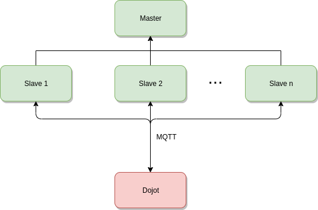

# **Dojot Load Test**
The Dojot Load Test tool is an implementation using the open-source load testing tool Locust to generate traffic from/to Dojot. Tested in Dojot's development images.


# **How to use**

## **Scripts**

This section will show how to use the scripts that are used to complement/help Locust tests.

### **Generate Certificates**

The main goal of this script is to generate certificates for devices. These can either be in Dojot or be virtual ones. It also is used to create test devices and clear devices/templates in Dojot.

#### **Setup**

To run this script, you will need a Dojot's EJBCA instance running elsewhere. You can either
run a full Dojot or a separate EJBCA instance. You can see [here](https://dojotdocs.readthedocs.io/en/stable/) for more info.

#### **How to use**

First you will need some Redis container going on. The preferred way is to use the Locust master Redis.
By using the same Redis, we can modify the database directly with the script.
```shell
docker-compose -f Docker/docker-compose-master.yml up -d
```

Run the Docker Compose file:
```shell
docker-compose -f Docker/scripts/generate_certs/docker-compose.yml up -d
```

You will have the `generate-certs` container running. Now enter in it:
```shell
docker-compose -f Docker/scripts/generate_certs/docker-compose.yml exec generate-certs bash
```

To facilitate the use of the script, we provide an alias for the actual command:
```shell
generate_certs
```

To check the script help:
```shell
generate_certs -h
```

#### **Example**

The next sections will exemplify the use of the `generate_certs` script in the most common use cases
it has.

##### **Without Dojot**

Generate the certificates:
```shell
generate_certs cert --devices 100
```

This will create and map the certificates in Redis, retrieve the CA certificate in the file `ca.crt`
and export all of them to `/cert` directory.

##### **With Dojot**

Generate test devices in Dojot:
```shell
generate_certs dojot create --devices 100
```

Generate the certificates for those devices:
```shell
generate_certs cert --dojot
```

##### **Redoing tests without stopping Locust containers**

After pressing the Stop button in Locust GUI, go to the `generate_certs` script and run:
```shell
generate_certs redis --restore
```

You can, of course, create another devices and certificates in the meantime, but you will always
need to restore the database after stopping the test.

## **Certificates**

If you don't have any certificates, you should first generate them. See the
[Generate Certificates](#generate-certificates) script for more info.

### **Redis dump**

If for some reason you need the Redis `dump.rdb` file, you can retrieve it either from the `db/`
directory or by running:
```shell
docker exec -it $REDIS_CONTAINER_ID redis-cli save
docker cp $REDIS_CONTAINER_ID:/data/dump.rdb .
```

To check the Redis container ID, you can run `docker ps`.

Be aware that every time you generate certificates, you should map the database. Check the
[Generate Certificates](#generate-certificates) script for more info.

## **Docker-Compose**

**Remember to change the environment variables to your needs before continuing.**

In Locust root directory, bring up the master node:

```shell
docker-compose -f Docker/docker-compose-master.yml up
```

After the complete initialization of the master node, run the slave:

```shell
docker-compose -f Docker/docker-compose-slave.yml up
```

You can also run more than one slave at once:

```shell
docker-compose -f Docker/docker-compose-slave.yml up --scale locust-slave=10
```

We recommend running no more slaves than the number of cores in your hardware.

## **Dockerfile**

If you need to execute the containers individually, you can build the image by
yourself and then run it. This approach is not recommended.

Building the image:
```shell
sudo docker build -t locust-mqtt .
```

Starting the container:
```shell
sudo docker run -it -d -p 8089:8089 locust-mqtt
```

Running the Locust code:
```shell
sudo docker exec -it <CONTAINER_ID> /bin/bash -c "locust -f main.py Client"
```

## **Accessing the GUI**

After the initialization of the master, you can access the graphical interface by
typing the address to the server you are running the master followed by the Locust
port, e.g: `localhost:8089`.

# **How it works**

Locust works with a master/slave architecture, as you can see in the diagram.

- The Master node is responsible for gathering and showing data from slaves using the
graphical interface
- The Slave node is responsible for making the communication with the server, sending
and receiving messages from Dojot

<p align="center">
  
</p>

The main idea behind Locust is to call **Locust tasks** from time to time to execute tests.
These tasks are run in the slaves only. In our case, we have only one task, responsible for
publishing MQTT messages with QoS 1 to the IoTAgent every 30s.

Aside from publishing, we receive messages too. Every time one client is created by Locust and
successfully connects to the server, it will subscribe to the config topic. The config topic
receives messages from Dojot to actuate in the device, so it is emulating an actuation in the
device - in our case, the device is a Locust client.

The used topics are:
- **Publish**: tenant:deviceid/attrs
- **Subscribe**: tenant:deviceid/config

## **Certificate revocation and renovation**

It is possible to simulate the revocation and renovation of certificates using this tool.
Be aware that in the beginning the system may not achieve the maximum connection RPS,
due to the certificates' files being written in the system.
To accomplish this, take a look at the following environment variables:

- RENEW_DEVICES and REVOKE_DEVICES to enable the simulations
- TIME_TO_RENEW and TIME_TO_REVOKE to control the time of renovation and revocation

## **Locust messages**

There are several messages that are displayed in Locust interface. These messages
are:
- connect: the client sent a connect message to the broker
- disconnect: the client sent a disconnect message to the broker or were disconnected
from the broker for some reason
- publish: the client published to the broker
- subscribe: the client sent a subscribe request to the broker
- recv_message: the client received a message from the subscribed topic
- renew: a certificate renovation request was sent to EJBCA
- revoke: a certificate revocation request was sent to EJBCA


# **Configuration**

All the commands in this guide are meant to be executed in the `locust` directory, a.k.a the directory this README
is on, unless otherwise told.

## **Environment Variables**

Before running any tests using this tool, make sure you configure the environment variables to match your needs.

When using Docker, you should pass the variables in the Dockerfile for the component you are running.
The Dockerfile for the Locust master and slave are in the `Docker` directory.

### **Locust**

Locust behaviour and Redis configurations.

Key                          | Purpose                                                        | Default Value | Valid Values                                  |
---------------------------- | -------------------------------------------------------------- | ------------- | --------------------------------------------- |
CA_CERT_FILE                 | CA certificate file                                            | ca.crt        | file name                                     |
CERT_DIR                     | certificates and private keys directory                        | cert/         | directory name                                |
DEBUG_MODE                   | activate debug mode in shell scripts                           | 0             | 0, 1                                          |
DEVICES_TO_RENEW             | number of devices to renew randomly                            | 1000          | integer                                       |
DEVICES_TO_REVOKE            | number of devices to revoke randomly                           | 1000          | integer                                       |
LOCUST_MASTER_NODE_HOST      | Locust master IP/hostname                                      | locust-master | hostname/IP                                   |
LOG_LEVEL                    | log level (case insensitive)                                   | info          | notset, debug, info, warning, error, critical |
MAX_TIME_RECONN              | max time (in seconds) to try to reconnect to the MQTT broker   | 600           | integer                                       |
MIN_TIME_RECONN              | min time (in seconds) to try to reconnect to the MQTT broker   | 1             | integer                                       |
PROBABILITY_TO_RENEW         | probability to renew a device                                  | 10            | integer in [0, 100]                           |
PROBABILITY_TO_REVOKE        | probability to revoke a device                                 | 10            | integer in [0, 100]                           |
REDIS_BACKUP                 | use a Redis dump with IDs instead of generating new ones       | y             | y, n                                          |
REDIS_CERTIFICATES_DB        | database with the certificates                                 | 0             | integer in [0, 15]                            |
REDIS_CONN_TIMEOUT           | redis timeout                                                  | 180           | integer                                       |
REDIS_HOST                   | redis host                                                     | redis         | hostname/IP                                   |
REDIS_MAPPED_DB              | database with the mapped device IDs from certificates database | 1             | integer in [0, 15]                            |
REDIS_PASSWD                 | redis password                                                 | none          | passwords                                     |
REDIS_PORT                   | redis port                                                     | 6379          | port value                                    |
REDIS_STORED_JWT_EXPIRE_TIME | time (in seconds) to expire the cached JWT                     | 1800          | positive integer                              |
RENEW_CERT_DIR               | directory where the certs to be renewed will be stored         | renew/        | directory name                                |
RENEW_DEVICES                | enable random renovation of devices (case insensitive)         | False         | True, False                                   |
REVOKE_CERT_DIR              | directory where the certs to be revoked will be stored         | revoke/       | directory name                                |
REVOKE_DEVICES               | enable random revocation of devices (case insensitive)         | False         | True, False                                   |
TASK_MAX_TIME                | max time of each Locust's tasks (sec)                          | 30            | integer                                       |
TASK_MIN_TIME                | min time of each Locust's tasks (sec)                          | 29            | integer                                       |
TENANT                       | tenant that is publishing                                      | admin         | string                                        |
TIME_TO_RENEW                | time to renew the cert after the client initialization         | 1000          | integer                                       |
TIME_TO_REVOKE               | time to revoke the cert after the client initialization        | 1000          | integer                                       |

### **MQTT**

Configurations related to MQTT communication.

Key                     | Purpose                    | Default Value | Valid Values      |
----------------------- | -------------------------- | ------------- | ----------------- |
DOJOT_DEVICES_PAGE_SIZE | /device endpoint page size | 20            | positive integers |
DOJOT_MQTT_HOST         | MQTT broker host           | 127.0.0.1     | hostname/IP       |
DOJOT_MQTT_PORT         | MQTT broker port           | 1883          | port value        |
DOJOT_MQTT_QOS          | MQTT broker QoS level      | 1             | 0, 1, 2           |
DOJOT_MQTT_TIMEOUT      | MQTT broker timeout        | 60            | integer           |

### **Dojot**

Dojot integration configuration.

Key                   | Purpose                              | Default Value         | Valid Values       |
--------------------- | ------------------------------------ | --------------------- | ------------------ |
DOJOT_ENV             | use a dojot instance                 | n                     | y, n               |
DOJOT_GATEWAY_TIMEOUT | dojot auth API timeout               | 180                   | integer            |
DOJOT_PASSWD          | dojot user's password                | admin                 | passwords          |
DOJOT_URL             | dojot instance address               | http://127.0.0.1:8000 | hostname/IP        |
DOJOT_USER            | dojot user                           | admin                 | usernames          |
DOJOT_API_RETRIES     | number of retries for API calls      | 3                     | integer            |
DOJOT_API_RETRY_TIME  | time to wait between retries         | 5000                  | float time in ms   |

## **Operating System**

While small tests can be run without problems, bigger ones create some obstacles.
To create a lot of clients in only one machine, the default number of ports in the
OS will not accomodate the required number of connections. To increase it, run:

```shell
sudo sysctl -w net/ipv4/ip_local_port_range="1024 65535"
```

# Development

## Lint

There is a lint in the repository that you should follow. To check the linting state in it, run:
```shell
run_lint
```

The command `run_lint` is an alias of `pylint src --rcfile=.pylintrc tests --rcfile=.pylintrc`.

## Unit Tests

To run the tests, you can use the Docker Compose file provided for use with the `generate_certs` script. In case you missed it, you can see it [here](#generate-certificates).
With the dependencies properly installed, you can get the complete tests' report by running:
```shell
run_cov
```

It will generate a HTML coverage report in the `htmlcov` directory.

The command `run_cov` is an alias of `coverage run -m pytest tests && coverage html`.


# **Machine specifications for tests**

To achieve 100.000 connections with ~3333 RPS (Requests Per Second), we used distributed Locust
in 4 virtual machines in a cluster. Their configuration were:

Cluster info:
- Intel(R) Xeon(R) Silver 4114 CPU @ 2.20GHz
- 62GB RAM DDR4 2,666 MHz
- 2TB 7.2K RPM HDD

VM1 and VM2 (each):
- 9 CPUs
- 14GB RAM
- 50GB HDD

VM3 and VM4 (each):
- 9 CPUs
- 14GB RAM
- 30GB HDD

In total:
- 36 CPUs
- 56GB RAM
- 160GB HDD

Each machine ran 9 slaves, with the VM1 running the master too.

# **Issues and help**

If you found a problem or need help, leave an issue in the main [Dojot repository](https://github.com/dojot/dojot) and we will help you!

# **References**
[Material to understand paho-mqtt threads](http://www.steves-internet-guide.com/loop-python-mqtt-client/)

[Locust]( https://locust.io/)

[Paho-MQTT Python Library](https://pypi.org/project/paho-mqtt/)
