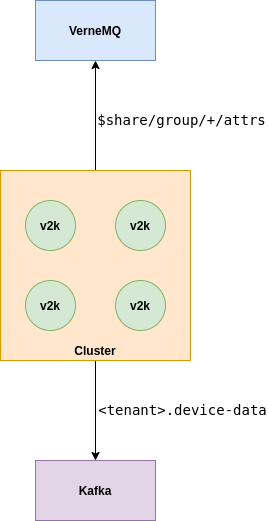

# **V2K-bridge**
The V2K-bridge service implements a bridge between VerneMQ broker and Kafka broker. Basically, it subscribes to some MQTT topics and forwards the messages to some Kafka topics following the dojot's topics rules. In order to scale the bridge service, shared MQTT subscriptions are used, which allows to instantiate a group of consumers, i.e. a group of bridge instances, when necessary. The communication between the bridge and the VerneMQ is secured with mutual TLS. Soon, the communication with Kafka will also use mutual TLS.

# **Configuration**

## **Environment Variables**

Before running the V2K-bridge service within your environment, make sure you configure the environment variables to match your needs.

Key                                | Purpose                                                                           | Default Value                         | Valid Values                   |
---------------------------------- | --------------------------------------------------------------------------------- | ------------------------------------- | ------------------------------ |
BASE_DIR                           | Base directory where the project is located                                       | /opt/v2k_bridge                       | string                         |
EJBCA_ADDRESS                      | Address of the EJBCA service                                                      | localhost:5583                        | hostname/IP:port               |
HOSTNAME                           | Hostname to be used in the certificate common name                                | broker                                | hostname/IP                    |
KAFKA_BROKER_LIST                  | Addresses of the kafka brokers separated by a comma                               | kafka-server:9092                     | hostname/IP:port               |
V2K_BACKPRESSURE_MAX_QUEUE_LENGTH  | Maximum backpressure queue length in bytes                                        | 1048576                               | integer                        |
V2K_BACKPRESSURE_PARALLEL_HANDLERS | Number of parallel handlers for processing the messages in the backpressure queue | 1                                     | integer                        |
V2K_CONSOLE_LOG_LEVEL              | Console log level                                                                 | info                                  | debug, info, warn, error       |
V2K_LOG_VERBOSE                    | Activate the verbose log mode                                                     | false                                 | true, false (case insensitive) |
V2K_KAFKA_PRODUCE_TOPIC_SUFFIX     | Kafka produce topic suffix                                                        | device-data                           | string                         |
V2K_MQTT_CA_FILE                   | MQTT client ca file                                                               | ${BASE_DIR}/app/verne/${HOSTNAME}.ca  | string                         |
V2K_MQTT_CERT_FILE                 | MQTT client certificate file                                                      | ${BASE_DIR}/app/verne/${HOSTNAME}.crt | string                         |
V2K_MQTT_CLIENT_ID                 | MQTT client client id                                                             | hostname                              | string                         |
V2K_MQTT_HOST                      | MQTT broker host                                                                  | vernemq-k8s                           | hostname/IP                    |
V2K_MQTT_KEEPALIVE                 | MQTT client keepalilve                                                            | 60                                    | integer                        |
V2K_MQTT_KEY_FILE                  | MQTT client key file                                                              | ${BASE_DIR}/app/verne/${HOSTNAME}.key | string                         |
V2K_MQTT_USERNAME                  | MQTT client username                                                              | v2k-bridge                            | string                         |
V2K_MQTT_PORT                      | MQTT broker port                                                                  | 8883                                  | integer                        |
V2K_MQTT_SECURE                    | MQTT client secure                                                                | true                                  | true, false (case insensitive) |
V2K_MQTT_SUBSCRIPTION_QOS          | MQTT client Quality of service                                                    | 1                                     | integer                        |
V2K_MQTT_SUBSCRIPTION_TOPIC        | MQTT client topic to subscribe                                                    | $share/group/+/attrs                  | string                         |

You can configure the Kafka Producer with variables from the Microservice SDK and librdkafka.
For more details on these configurations,
please read the [librdkafka official configuration guide](https://github.com/edenhill/librdkafka/blob/master/CONFIGURATION.md)
and [Microservice SDK documentation](https://www.npmjs.com/package/@dojot/microservice-sdk).

SDK configurations:

Key                                | Default Value   |
---------------------------------- | --------------- |
V2K_PRODUCER_CONNECT_TIMEOUT_MS    | 5000            |
V2K_PRODUCER_DISCONNECT_TIMEOUT_MS | 10000           |
V2K_PRODUCER_FLUSH_TIMEOUT_MS      | 2000            |
V2K_PRODUCER_POOL_INTERVAL_MS      | 100             |

librdkafka configurations:

Key                                             | Default Value     |
----------------------------------------------- | ----------------- |
V2K_KAFKA_ACKS                                  | -1                |
V2K_KAFKA_BATCH_NUM_MESSAGES                    | 10000             |
V2K_KAFKA_CLIENT_ID                             | ${HOSTNAME}       |
V2K_KAFKA_COMPRESSION_CODEC                     | none              |
V2K_KAFKA_DR_CB                                 | true              |
V2K_KAFKA_ENABLE_IDEMPOTENCE                    | false             |
V2K_KAFKA_MAX_IN_FLIGHT_REQUESTS_PER_CONNECTION | 1000000           |
V2K_KAFKA_METADATA_BROKER_LIST                  | kafka-server:9092 |
V2K_KAFKA_QUEUE_BUFFERING_MAX_KBYTES            | 1048576           |
V2K_KAFKA_QUEUE_BUFFERING_MAX_MS                | 0.5               |
V2K_KAFKA_RETRIES                               | 2                 |
V2K_KAFKA_RETRY_BACKOFF_MS                      | 100               |
V2K_KAFKA_SOCKET_KEEPALIVE_ENABLE               | false             |