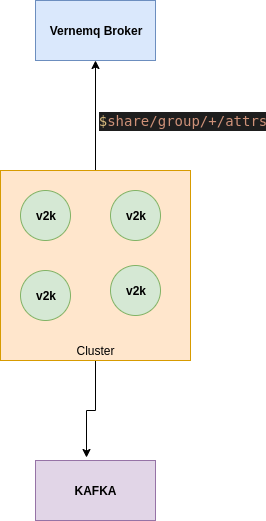

# **V2K-bridge**
The V2K-bridge service implements a bridge between VerneMQ broker and Kafka broker. Basically, it subscribes to some MQTT topics and forwards the messages to some Kafka topics following the dojot's topics rules. In order to scale the bridge service, shared MQTT subscriptions are used, which allows to instantiate a group of consumers, i.e. a group of bridge instances, when necessary. The communication between the bridge and the VerneMQ is secured with mutual TLS. Soon, the communication with Kafka will also use mutual TLS.

 

# **Configuration**

## **Environment Variables**

Before running the V2K-bridge service within your environment, make sure you configure the environment variables to match your needs.

Key                      | Purpose                                                             | Default Value       | Valid Values   |
------------------------ | ------------------------------------------------------------------- | ---------------     | -------------- |
HOSTNAME                 | Hostname to be used in the certificate common name                  | broker              | hostname/IP    |
EJBCA_ADDRESS            | Address of the EJBCA broker                                         | localhost:5583      | hostname/IP    |
DATA_BROKER_ADDRESS      | Address of the data broker                                          | data-broker:80      | hostname/IP    |
KAFKA_BROKER_LIST        | Addresses of the kafka brokers separated by a comma                 | kafka-server:9092   | hostname/IP    |
V2K_LOG_LEVEL            | Log level                                                           | info                | string         |
BASE_DIR                 | Base directory where the project is located                         | /opt/v2k_bridge     | string         |
V2K_MQTT_USERNAME        | Mqtt client username                                                | v2k-bridge          | string         |
V2K_MQTT_CLIENT_ID       | Mqtt client client id                                               | hostname            | string         |
V2K_MQTT_HOST            | Mqtt broker host                                                    | localhost           | hostname/IP    |
V2K_MQTT_PORT            | Mqtt broker port                                                    | 8883                | integer        |
V2K_MQTT_KEEPALIVE       | Mqtt client keepalilve                                              | 60                  | integer        |
V2K_MQTT_SECURE          | Mqtt client secure                                                  | true                | boolean/string/integer  |
V2K_MQTT_SUBSCRIPTION_TOPIC | Mqtt client topic to subscribe                                   | $share/group/+/attrs| string         |
V2K_MQTT_SUBSCRIPTION_QOS| Mqtt client Quality of service                                      | 1                   | integer        |
V2K_MQTT_CA_FILE         | Mqtt client ca file                                                 | ${BASE_DIR}/app/verne/${HOSTNAME}.ca | string    |
V2K_MQTT_CERT_FILE       | Mqtt client certificate file                                        | ${BASE_DIR}/app/verne/${HOSTNAME}.crt| string    |
V2K_MQTT_KEY_FILE        | Mqtt client key file                                                | ${BASE_DIR}/app/verne/${HOSTNAME}.key| string    |
V2K_BACKPRESSURE_MAX_QUEUE_LENGTH | Maximum backpressure queue length in bytes                 | 1048576                              | integer   |
V2K_BACKPRESSURE_PARALLEL_HANDLERS| Number of parallel handlers for processing the messages in the backpressure queue| 1              | integer   |