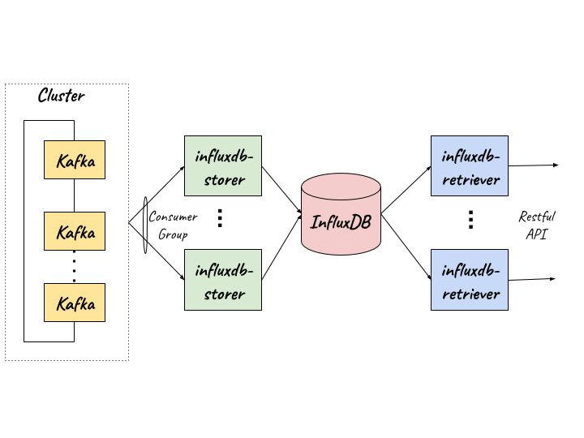

# InfluxDB Storer and Retriever

The services **InfluxDB Storer** and **InfluxDB Retriever** work together, the **InfluxDB Storer** is responsible for consuming Kafka data from dojot devices and writing it to **InfluxDB**, while the **InfluxDB Retriever** has the role of obtaining the data that were written by **InfluxDB Storer** in **InfluxDB** via API REST.
See the image below for a better understanding:

__NOTE THAT__ It's mandatory to set default organization, bucket, user, and password before starting the services, optionally a retention. You can see an example in the [example](./example) folder.
## InfluxDB Storer

Check the [storer](./storer) directory for more details.

## InfluxDB Retriever

Check the [retriever](./retriever) directory for more details.

## Example

Check the [example](./example) directory for more details.

## Documentation

Check the documentation for more information:

- [Latest InfluxDB Retriever API documentation](https://dojot.github.io/dojot/storage/time-series/influxdb/retriever/doc.html)
- [Development InfluxDB Retriever API documentation](https://dojot.github.io/dojot/storage/time-series/influxdb/retriever/doc.html?version=development)
- [Latest dojot platform documentation](https://dojotdocs.readthedocs.io/en/latest)

## Issues and help

If you found a problem or need help, leave an issue in the main
[dojot repository](https://github.com/dojot/dojot) and we will help you!
