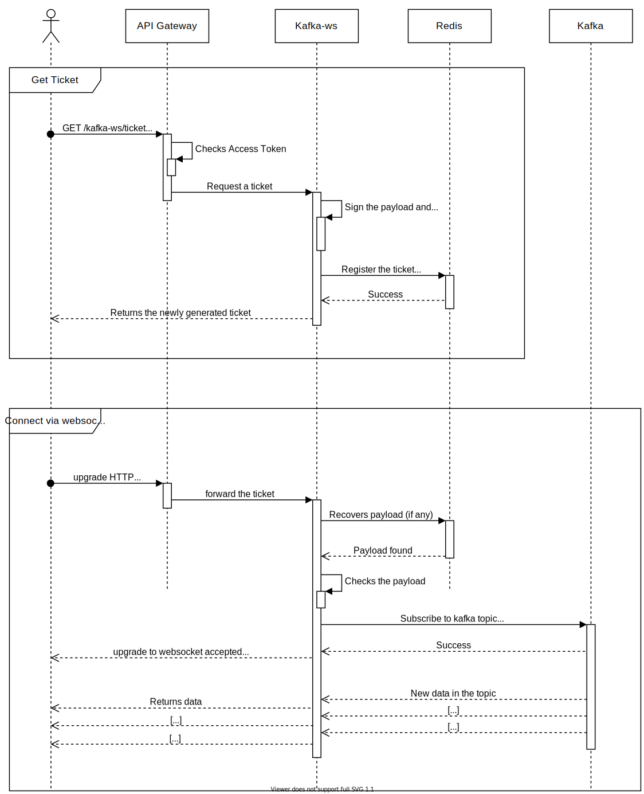
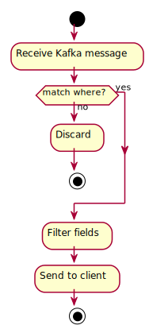

# **Kafka WS**

The **Kafka WS** service provides support for retrieving data from Apache Kafka through pure WebSocket connections.

It was designed to be used in the context of dojot IoT Platform for allowing users to retrieve realtime raw and/or processed data.

## **Overview**

**Kafka WebSocket service** allows the users to retrieve data from a given dojot topic in a Kafka cluster, this retrieval can be conditional and/or partial. It works with pure websocket connections, so you can create websocket clients in any language you want as long as they support [RFC 6455](https://tools.ietf.org/html/rfc6455).

### **Connecting to the service**

The connection is done in two steps, you must first obtain a *single-use ticket* through a REST request, then, be authorized to connect to the service through a websocket.

#### **First step**: Get the single-use ticket

A ticket allows the user to subscribe to a dojot topic. To obtain it is necessary to have a JWT access token that is issued by the platform's Authentication/Authorization service.
Ticket request must be made by REST at the endpoint `<base-url>/kafka-ws/v1/ticket` using the HTTP GET verb. The request must contain the header `Authorization` and the JWT token as value, according to the syntax:

    POST <base-url>/v1/ticket
    Authorization: Bearer [Encoded JWT]

The component responds with the following syntax:

    HTTP/1.1 200 OK
    Content-type: application/json
    {
      "ticket": "[an opaque ticket of 64 hexadecimal characters]"
    }

Note: In the context of a dojot deployment the JWT Token is provided by the *Auth service*, and is validated by the *API Gateway* before redirecting the connection to the Kafka-WS. So, no validations are done by the Kafka WS.

#### **Second step**: Establish a websocket connection

The connection is done via pure websockets using the URI `<base-url>/kafka-ws/v1/topics/:topic`. You **must** pass the previously generated ticket as a parameter of this URI. It is also possible to pass conditional and filter options as parameters of the URI.

#### Behavior when requesting a ticket and a websocket connection

Below we can understand the behavior of the Kafka-ws service when a user (through a [user agent](https://en.wikipedia.org/wiki/User_agent)) requests a ticket in order to establish a communication via websocket with Kafka-ws.

Note that when the user requests a new ticket, Kafka-ws extracts some information from the _user's access token_ and generates a _signed payload_, to be used later in the decision to authorize (or not) the connection via websocket. From the payload a _ticket_ is generated and the two are stored in Redis, where the ticket is the key to obtain the payload. A [TTL](https://en.wikipedia.org/wiki/Time_to_live) is defined by Kafka-ws, so the user has to use the ticket within the established time, otherwise, Redis automatically deletes the ticket and payload.

After obtaining the ticket, the user makes an HTTP request to Kafka-ws requesting an upgrade to communicate via _websocket_. As the specification of this HTTP request limits the use of additional headers, it is necessary to send the ticket through the URL, so that it can be validated by Kafka-ws before authorizing the upgrade.<br>
Since the ticket is valid, that is, it corresponds to an entry on Redis, Kafka-ws retrieves the payload related to the ticket, verifies the integrity of the payload and deletes that entry on Redis so that the ticket cannot be used again.<br>
With the payload it is possible to make the decision to authorize the upgrade to websocket or not. If authorization is granted, Kafka-ws opens a subscription channel based on a specific topic in Kafka.
From there, the upgrade to websocket is established and the user starts to receive data as they are being published in Kafka.



In the following sections, it is explained in details how to compose the URI to retrieve filtered and/or partial data from a given topic.<br>

If you want to jump for a full client example, see the [examples](./examples) directory.

### **Understanding the URI parts**

Before diving into the explanation of how each filter works and its rules, it is necessary to understand the parts of the URI. It's general format is:

```
/kafka-ws/v1/topics/:topic?ticket=<hexValue>&fields=<selector>&where=<conditions>
```

#### Topic

The `:topic` parameter is the Kafka topic that you want to receive data from.

#### ticket

The `ticket` parameter is the previously generated *single-use* ticket

##### Fields

The `fields` parameter tells Kafka WS to retrieve only determined parameters from the messages.

See [this section](###selecting-parameters-fields) for an explanation.

##### Where

The `where` parameter tells Kafka WS to retrieve only messages in which the parameters meet the
conditions.

Grammar:

- `where → expression:*`
- `expression → condition:+`
- `condition → selector=(operator:):?values;`
- `selector → parameter | parameter.selector`
- `operator → `[see here](###applying-conditions-where)
- `values → value | value,values`

Where:

- `:*` - zero or more
- `:+` - one or more
- `:?` - zero or one

##### **URI Examples**

__NOTE THAT__ for simplicity, we will not include the `ticket` parameter in the examples, but it
must always be sent, otherwise the server will refuse the connection.

__NOTE THAT__ you can use spaces in the filtering parameters, but, depending on your URI building
method, you must ensure all the spaces are represented as `+` signs. Example:

```
/kafka-ws/v1/topics/topic.example?where=attrs.+brake+signal+1+=gte:0.0;&fields=attrs/+brake+signal+1+
```

To ilustrate the parameters' usage, here are some examples of valid URIs:

Retrieving full messages from `topic.example` topic:

```
/kafka-ws/v1/topics/topic.example
```

Retrieving a sensor *status* and *temperature* when the *status* is `failed` or `stopped`:

```
/kafka-ws/v1/topics/topic.example?fields=sensor/status,temperature&where=sensor.status=in:failed,stopped;
```

Retrieving the *temperature* and *location*:

```
/kafka-ws/v1/topics/topic.example?fields=temperature,location
```

Retrieving full messages where *temperature* is <ins>greater than or equal to</ins> 5.0 and <ins>less than</ins> 10.0:

```
/kafka-ws/v1/topics/topic.example?where=temperature=gte:5.0;temperature=lt:10.0;
```

Retrieving the *temperature* and *rain* where *rain* is <ins>less than or equal to</ins> 15:

```
/kafka-ws/v1/topics/topic.example?where=rain=lte:15;&fields=temperature,rain
```

### **Filtering flow**

The filtering happens right after a message is received from a Kafka topic that the client has
requested to subscribe. The message is then filtered by `where` (if present) and then by `fields`
(if present). This flow is better explained in the next image:



**Fig. 1** - Kafka messages' flow within the system.

### **Selecting parameters (`fields`)**

The rules to select parameters from a message are:

- `a,b,c`: select multiple parameters
- `a/b/c`: select a parameter from its parent
- `a(b,c)`: select multiple parameters from a specific parameter
- `a/*/c`: wildcard selection

__NOTE THAT__ if you select parameters that do not exist in their parent's object, it will return
an empty object. Check the examples for a better understanding.

Examples:

Let's filter the following object:
```js
{ attrs: { temperature: 20, rain: 10.5 }, metadata: { tenant: 'admin' } }
```

Filters and its results:
```js
f('attrs,metadata') => { attrs: { temperature: 20, rain: 10.5 }, metadata: { tenant: 'admin' } }
f('metadata/tenant') => { metadata: { tenant: 'admin' } }
f('attrs(temperature,rain)') => { attrs: { temperature: 20, rain: 10.5 } }
f('attrs/*') => { attrs: { temperature: 20, rain: 10.5 } }
f('attrs/humidity') => { attrs: { } }
```

__NOTE THAT__ in the last example the `attrs` object is empty. This happens if no attribute matches
the sent filter. It will not throw an error.

### **Applying conditions (`where`)**

The conditions can be applied to any parameter in the message. The permitted operators are:

#### **Set operators**

Applied to N values.

__NOTE THAT__ all values are treated as **string**.

- `in`: returns the parameter if any string in the list is contained in it
- `nin`: returns the parameter if any string in the list is not contained in it

Examples:

```
{ a: 'foo', b: 'bar' } → f(a=in:bar,baz) → discard
{ a: 'foo', b: 'bar' } → f(b=in:ar) → continue to process
{ a: 'foo', b: 'bar' } → f(a=nin:bar,baz) → continue to process
{ a: 'foo', b: 'bar' } → f(b=nin:ar) → discard
```

#### **Arythmetic operators**

Applied to only one value.

__NOTE THAT__ all values are treated as **float**.

- `eq`: equal (the default operator)
- `neq`: not equal
- `gt`: greater than
- `gte`: greater than or equal to
- `lt`: less than
- `lte`: less than or equal to

Examples:

```js
{ rain: 10, temperature: 30.0 } → f(rain=10) → continue to process
{ rain: 10, temperature: 30.0 } → f(rain=eq:11) → discard
{ rain: 10, temperature: 30.0 } → f(rain=neq:11) → continue to process
{ rain: 10, temperature: 30.0 } → f(rain=gt:10) → discard
{ rain: 10, temperature: 30.0 } → f(rain=gte:10) → continue to process
{ rain: 10, temperature: 30.0 } → f(rain=lt:10) → discard
{ rain: 10, temperature: 30.0 } → f(rain=lte:10) → continue to process
```

#### **Boolean operators**

Applied to only one value.

- `bool`: verifies if the value is true or false

Examples:

```js
{ sensors: { rain: { enabled: true } } } → f(sensors.rain.enabled=bool:true) → continue to process
{ sensors: { rain: { enabled: true } } } → f(sensors.rain.enabled=bool:false) → discard
{ sensors: { rain: { enabled: false } } } → f(sensors.rain.enabled=bool:false) → continue to process
```

### Connection Error Codes

The errors generated by the service are listed below.

#### **HTTP error codes**

- `426`: occurs when the received connection is not a Websocket one.

#### **Websocket error codes**

- `4000` - INVALID_SYNTAX: there is a syntatic problem with `where`
- `4001` - INVALID_OPERATOR: an invalid operator has been passed to a condition, see the [list of
operators](###applying-conditions-where) for more info
- `4002` - INVALID_ESCAPE_VALUE: an unsupported escape character has been passed to a condition
- `4003` - INVALID_OPERATOR_ARITY: the number of values in a condition is invalid for the operator
- `4004` - INVALID_VALUE: a value with an invalid type was passed to a condition
- `4403` - FORBIDDEN_TOPIC: the tenant sent in JSON Web Token (JWT) cannot access the kafka topic passed
- `4408` - EXPIRED_CONNECTION: connection lifetime is over
- `4999` - INTERNAL: there is an error in the server

## **Running the service**

### **Configuration**

Before proceeding, **make sure you configure your environment**.

Key                    | Purpose                                                                                     | Default Value                       | Valid Values                  |
---------------------- | ------------------------------------------------------------------------------------------- | ----------------------------------- | ----------------------------- |
NODE_ENV               | Is used (by convention) to state in which environment it is running                         | production                          | *production* or *development* |
LOG_LEVEL              | Log level                                                                                   | info                                | info, warn, debug, error      |
LOG_VERBOSE            | Enables verbose mode for logging                                                            | false                               | true or false / 1 or 0        |
LOG_FILE               | Enables logging on files  (location: /var/log/kafka-ws-logs-%DATE%.log)                     | false                               | true or false / 1 or 0        |
LOG_FILE_LEVEL         | Log level to log on files                                                                   | debug                               | info, warn, debug, error      |
KAFKA_HOSTS            | comma-separated list of Kafka hosts (with port)                                             | kafka-server:9092                   | list of hostname:port         |
KAFKA_WS_HOST          | Kafka WS address                                                                            | 0.0.0.0                             | hostname                      |
KAFKA_WS_PORT          | Kafka WS port                                                                               | 8080                                | valid port                    |
KAFKA_WS_TLS           | Enables TLS (Needs: KAFKA_WS_TLS_CA_FILE, KAFKA_WS_TLS_KEY_FILE and KAFKA_WS_TLS_CERT_FILE) | false                               | true or false / 1 or 0        |
KAFKA_WS_TLS_CA_FILE   | Kafka WS ca file location                                                                   | /opt/kafka-ws/certs/ca-cert.pem     | valid path                    |
KAFKA_WS_TLS_KEY_FILE  | Kafka WS key file location                                                                  | /opt/kafka-ws/certs/server-key.pem  | valid path                    |
KAFKA_WS_TLS_CERT_FILE | Kafka WS certificate file location                                                          | /opt/kafka-ws/certs/server-cert.pem | valid path                    |
KAFKA_WS_JWT_EXP_TIME  | Enables use of expiration time from the informed JWT when requesting a *single-use ticket*. | false                               | true or false / 1 or 0        |
TICKET_EXPIRATION_SEC  | Duration time (in seconds) of the *single-use ticket*.                                      | 60                                  | seconds                       |
TICKET_SECRET          | Secret used to sign *single-use tickets* and prevent forgery                                | Random value                        | string                        |
KAFKA_WS_MAX_LIFE_TIME | Maximum lifetime of a connection   (-1 to disable)                                          | 7200                                | seconds                       |
REDIS_HOST             | Redis host                                                                                  | kafka-ws-redis                      | string                        |
REDIS_PORT             | Redis port                                                                                  | 6379                                | number                        |
REDIS_DATABASE         | Redis database                                                                              | 1                                   | number                        |
KAFKA_WS_REQUEST_CERT  | Whether the service should request for a client certificate or not                          | false                               | boolean                       |

__NOTE THAT__ a websocket connection is closed by the server when certain conditions are met. If KAFKA_WS_JWT_EXP_TIME is set to true, the server will consider this value for closing the connection if it is greater than the KAFKA_WS_MAX_LIFE_TIME. If KAFKA_WS_JWT_EXP_TIME is set to false and KAFKA_WS_MAX_LIFE_TIME is set to -1, the server will never close a connection by its duration.

__NOTE THAT__ it is checked whether the service (tenant) that is passed in the JSON Web Token (JWT) when requesting a *single-use ticket* can access the kafka topic, generally topics start with `tenant.*`

__NOTE THAT__ if you pass a TICKET_SECRET, give preference to large random values. Also note that in a cluster environment all instances must share the same secret.


### **Parser compilation**

Before running the service, it is necessary to compile the Nearley parser:

```shell
npm run parser:compile
```

### **Standalone Mode**

To run the Kafka WS in the standalone mode, just type:

```shell
npm run kafka-ws
```

If you are developing, you can use `nodemon` too:

```shell
npm run dev
```
## NOTE
To use WebSocket with Nginx, Kong, Api gateway or similar, look for timeout settings. In Nginx, for example: proxy_connect_timeout, proxy_send_timeout and proxy_connect_timeout; And in Kong on a Service, for example: connect_timeout, write_timeout and read_timeout.

## **Examples**

Check the [examples](./examples) directory for more info.
