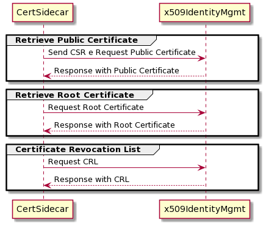

# **Cert-Sidecar**

The **Cert-Sidecar**, certificate sidecar, is a service utility for managing [x509-identity-mgmt](../../x509-identity-mgmt) certificates for use with TLS connections.

__NOTE THAT__ In Kubernetes, a pod is a group of one or more containers with shared storage and network. A sidecar is a utility container in a pod that’s loosely coupled to the main application container.

## **Table of Contents**

- [**Cert-Sidecar**](#cert-sidecar)
  - [**Table of Contents**](#table-of-contents)
  - [**Overview**](#overview)
  - [Dependencies](#dependencies)
    - [Dojot Services](#dojot-services)
  - [Running the service](#running-the-service)
    - [Configuration](#configuration)
      - [General](#general)
      - [Certificates](#certificates)
      - [Cron](#cron)
      - [x509 identity mgmt](#x509-identity-mgmt)
      - [Service State Manager](#service-state-manager)
  - [How to run](#how-to-run)
  - [Documentation](#documentation)
  - [Issues and help](#issues-and-help)

## **Overview**

The **Cert-Sidecar** generates a set of files to help configure a service to use TLS and can be used by sharing volumes (folder/files) between services/containers.

One of the things that **Cert-Sidecar** does is generate a key pair and then a CSR (Certificate Signing Request), which can look like a *certification intent*. Then **Cert-Sidecar** sends this CSR to *x509-identity-mgmt* to obtain a public certificate. In addition, **Cert-Sidecar** retrieves the root certificate from the CA and the CRL (certificate revocation lists) from *x509-identity-mgmt*.See the diagram below:

<p align="center">
   
</p>

Another important point in **Cert-Sidecar** is to guarantee the validity of the current public certificate and the root certificate of the CA, in each of the configured times the **Cert-Sidecar** will verify:

- whether the certificates are about to expire based on a configured time and retrieve new certificates if it makes sense;
- if the certificate has been revoked, listed on the CRL, and retrieve new certificates, if it makes sense.

In addition, to ensure that the CRL (Certificate Revocation Lists) is always updated, every time in the configured time, **Cert-Sidecar** will check if there is a new CRL and update it if different.

In the end, we can say that **Cert-Sidecar** creates four files in the *PEM* format: a *Private key*, *Public certificate*, *CA certificate* and *CRL*.

__ATTENTION__ When the service is unable to retrieve a CRL or update certificates if they have been revoked or expired (if these settings are active), after several defined attempts using the Exponential Backoff strategy the service will terminate and delete all files (if deletions are enabled). And at each configured time, the service checks if it can connect with *x509-identity-mgmt* and if it does not, the service changes to unhealthy. For more information about that, check the [__Service State Manager__ ](https://github.com/dojot/dojot-microservice-sdk-js/blob/master/lib/serviceStateManager/README.md) module in our [Microservice SDK](https://github.com/dojot/dojot-microservice-sdk-js).

__ATTENTION__  It's important to note that in services that use Node.js and [TLS module](https://nodejs.org/api/tls.html#tls_tls_ssl), the certificates, including the crl, are not changed automatically after the service starts even if the files are updated. The [`server.setSecureContext()`](https://nodejs.org/api/tls.html#tls_server_setsecurecontext_options) method can be used for this purpose, available from version 11 of Node.js. 

There is a examples of how to use  **Cert-Sidecar** with kubernetes and docker-compose within the directory [examples](./examples).

## Dependencies

The services dependencies are listed in the next topics.

- Dojot Services: They are dojot services

### Dojot Services

- x509 identity mgmt >= v0.5.0

## Running the service

### Configuration

Before running the **Cert-Sidecar** service within your environment, make sure you configure the
environment variables to match your needs.

You can select the configuration file via the `CERT_SC_USER_CONFIG_FILE` variable. Its default value
is `production.conf`. Check the [config directory](./config) for the user configurations that are
available by default.

For more information about the usage of the configuration files and environment variables, check the
__ConfigManager__ module in our [Microservice SDK](https://github.com/dojot/dojot-microservice-sdk-js).
You can also check the [ConfigManager environment variables documentation](https://github.com/dojot/dojot-microservice-sdk-js/blob/master/lib/configManager/README.md#environment-variables) for more details.

In short, all the parameters in the next sections are mapped to environment variables that begin
with `CERT_`. You can either use environment variables or configuration files to change their values.
You can also create new parameters via environment variables by following the forementioned convention.

#### General

General configurations

| Key | Purpose | Default Value | Valid Values | Environment variable
| --- | ------- | ------------- | ------------ | --------------------
| app.sidecar.to      | Suffix to be used to identify logs | app | string | CERT_SC_APP_SIDECAR_TO
| app.delete.certificates  | Enables deleting certificate files if you are unable to connect and retrieve a new one after a given number of attempts | false | boolean | CERT_SC_APP_DELETE_CERTIFICATES
| app.shutdown  | Enables the service to gracefully shut down if after a given number of attempts it is not possible to obtain new certificates | true | boolean | CERT_SC_APP_SHUTDOWN
| log.console.level   | Console logger level | info | info, debug, error, warn | CERT_SC_LOG_CONSOLE_LEVEL
| log.verbose | Whether to enable logger verbosity or not | false | boolean | CERT_SC_LOG_VERBOSE
| log.file            | Enables logging on file (location: /var/log/cert-sidecar-logs-%DATE%.log) | false | boolean  | CERT_SC_LOG_FILE
| log.file.level      | Log level to log on files | debug | string  | CERT_SC_LOG_LEVEL

#### Certificates

Certificates configurations

| Key | Purpose | Default Value | Valid Values | Environment variable
| --- | ------- | ------------- | ------------ | --------------------
| certs.common.name   | The CN (common name). If the *HOSTNAME* environment variable is passed, this value will be ignored. | ${HOSTNAME:-generic-commonName} | string | CERT_SC_CERTS_COMMON_NAME
| certs.hostnames     | The Subject Alternative Name field | ["localhost"] | array of hostname/ip | CERT_SC_CERTS_HOSTNAMES
| certs.expiration.checkend.sec | The time window configured in seconds that defines whether the certificate is considered expired. If the time to expire is less than or equal to that time, it is considered expired. | 43200 | integer | CERT_SC_CERTS_EXPIRATION_CHECKEND
| certs.crl | Enables the use of CRL (obtaining and creating the file)  | false | boolean | CERT_SC_CERTS_CRL
| certs.files.basepath | Path to create files  | /certs | path | CERT_SC_CERTS_FILES_BASEPATH
| certs.files.ca |  CA root certificate filename | ca.pem | filename  | CERT_SC_CERTS_FILES_CA
| certs.files.cabundle |  CA certificates Bundle (TrustStore) filename | cabundle.pem | filename  | CERT_SC_CERTS_FILES_CABUNDLE
| certs.files.cert | Public certificate filename | cert.pem | filename  | CERT_SC_CERTS_FILES_CERT
| certs.files.crl | CRL filename  | crl.pem | filename | CERT_SC_CERTS_FILES_CRL
| certs.files.key | Private keys filename | key.pem | filename | CERT_SC_CERTS_FILES_KEY

#### Cron

Cron configurations

| Key | Purpose | Default Value | Valid Values | Environment variable
| --- | ------- | ------------- | ------------ | --------------------
| cron.crl | Enables the use of *cron* for updating CRL. | true | boolean | CERT_SC_CRON_CRL
| cron.crl.time | Cron patterns for updating CRL. [Read up on cron patterns](https://www.npmjs.com/package/cron#available-cron-patterns) | `0 * */2 * * *` | string | CERT_SC_CRON_CRL_TIME
| cron.expiration | Enables the use of *cron* for checking expiration for Public Certificate and Public CA certificate.  | true | boolean | CERT_SC_CRON_EXPIRATION
| cron.expiration.time |  Cron patterns for checking expiration. [Read up on cron patterns](https://www.npmjs.com/package/cron#available-cron-patterns) | `0 * */1 * * *` | string | CERT_SC_CRON_EXPIRATION_TIME
| cron.revoke | Enables the use of *cron* for checking if the  Public Certificate is revoked. This needs `certs.crl` to be true. Note: *x509 identity mgmt*  is not yet supported for revoking internal certificates | false | boolean | CERT_SC_CRON_REVOKE
| cron.revoke.time |  Cron patterns for checking revoking. [Read up on cron patterns](https://www.npmjs.com/package/cron#available-cron-patterns) | `0 * */3 * * *` | string | CERT_SC_CRON_REVOKE_TIME
| cron.cabundle | Enables the use of *cron* for update the CA certificates Bundle (TrustStore) | true | boolean | CERT_SC_CRON_CABUNDLE
| cron.cabundle.time |  Cron patterns for update the CA certificates Bundle. [Read up on cron patterns](https://www.npmjs.com/package/cron#available-cron-patterns) | `0 * */1 * * *` | string | CERT_SC_CRON_CABUNDLE_TIME


#### x509 identity mgmt

X509 identity mgmt configurations

| Key | Purpose | Default Value | Valid Values | Environment variable
| --- | ------- | ------------- | ------------ | --------------------
| x509.url            | Address of the *x509 identity mgmt* service   | http://x509-identity-mgmt:3000 | url | CERT_SC_X509_URL
| x509.healthchecker.ms | Specifies how often it is to check if it is possible to communicate with the *x509 identity mgmt* in milliseconds. | 60000 | integer | CERT_SC_X509_HEALTHCHECKER
| x509.path.sign | Resource to sign the csr, create a public certificate.  | /internal/api/v1/throw-away | string | CERT_SC_X509_PATH_SIGN
| x509.path.crl | Resource to retrieve the latest CRL released by the root CA. | /internal/api/v1/throw-away/ca/crl | string | CERT_SC_X509_PATH_CRL
| x509.path.ca | Resource to retrieve the root CA of the dojot platform | /internal/api/v1/throw-away/ca | string | CERT_SC_X509_PATH_CA
| x509.path.cabundle | Resource to retrieve the root CA of the dojot platform and all the external trusted CAs | /internal/api/v1/throw-away/ca/bundle | string | CERT_SC_X509_PATH_CABUNDLE
| x509.retries | Number of retries when using *x509 identity mgmt*  before service shutdown. The strategy used is described in [Exponential Backoff](https://developers.google.com/analytics/devguides/reporting/core/v3/errors#backoff) | 9 | integer | CERT_SC_X509_RETRIES
| x509.timeout.ms | Specifies the number of milliseconds before the request times out. If the request takes longer than `timeout`, the request will be aborted. | 1000 | integer | CERT_SC_X509_TIMEOUT

#### Service State Manager

These parameters are passed directly to the SDK ServiceStateManager. Check the
[official repository](https://github.com/dojot/dojot-microservice-sdk-js) for more info on the
values.

| Key | Default Value | Valid Values | Environment variable
| --- | ------------- | ------------ | --------------------
| lightship.detect.kubernetes | false | boolean | CERT_LIGHTSHIP_DETECT_KUBERNETES
| lightship.graceful.shutdown.timeout | 60000 | number | CERT_LIGHTSHIP_GRACEFUL_SHUTDOWN_TIMEOUT
| lightship.port | 8889 | number | CERT_LIGHTSHIP_PORT
| lightship.shutdown.delay | 5000 | number | CERT_SHUTDOWN_DELAY
| lightship.shutdown.handler.timeout | 5000 | number | CERT_SHUTDOWN_HANDLER_TIMEOUT

## How to run

Beforehand, you need an already running dojot instance in your machine. Check out the
[dojot documentation](https://dojotdocs.readthedocs.io)
for more information on installation methods.

Generate the Docker image:

```shell
docker build -t <username>/cert-sidecar:<tag> -f  .
```

Then the image tagged a `<username>/cert-sidecar:<tag>` will be made available. You can send it to
your DockerHub registry to made it available for non-local dojot installations:

```shell
docker push <username>/cert-sidecar:<tag>
```

__NOTE THAT__  you can use the official image provided by dojot in its  [DockerHub page](https://hub.docker.com/r/dojot/cert-sidecar).

## Documentation

Check the documentation for more information:

- [Latest dojot platform documentation](https://dojotdocs.readthedocs.io/en/latest)

## Issues and help

If you found a problem or need help, leave an issue in the main
[dojot repository](https://github.com/dojot/dojot) and we will help you!
