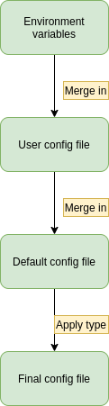

# microservice-sdk

This nodejs module aims to help developers to build microservices in the dojot's context.
It gives utility features that most of the dojot microservices needs to implement.

__NOTE THAT__ this module does not intend to be a generic microservice SDK, but a
library scoped to attend the dojot microservices necessities.

## Usage

### Logging

To log messages, you use the Logger class, which is a wrapper over the winston logging
library. It supports logging messages to both 'console' and 'file' which is rotated.

The messages are logged in the 'console' using the following format:

```bash
ts -- sid -- LEVEL: (file:line) [rid] message {extra}
```

Where:

* ts: timestamp in ISO format
* sid: service identification
* level: error, warn, info or debug
* (file:line): file and line of the log message (optional metadata)
* [rid]: request identifier (optional metadata)
* message: message in string format
* extra: any additional data aggregated in an object - user specific (optional metadada)

The messages are logged in the 'file' using the following json format:

```js
{
  level: string,
  timestamp: <number>,
  sid: <string>,
  rid: <string>,
  message: <string>,
  file: <string>,
  line: <number>,
  extra: <object>,
 }
```

Where:

* ts: timestamp in unix format
* sid: service identification
* level: error, warn, info or debug
* rid: request identifier (optional metadata)
* message: message in string format
* file: file of the log message (optional metadata)
* line: line of the log message (optional metadata)
* extra: any additional data aggregated in an object - user specific (optional metadada)

The transports ('console' and 'file') are shared by all instances of the wrapper. So,
any change in the transports will affect all instances.

By default, console transport is set, but this can be changed as part of the configuration
or initialization of the microservice.

It's usage is very simple and is shown by the following example:

```js
const { Logger } = require('@dojot/microservice-sdk');

// By default, console transport is enabled; but you can
// change it or add a file transport if required.
// It's worth to say that the transports are shared by all
// modules of the microservice; consequently, any change
// in the configuration will be valid for all!

// Setting console transport (this will replace the console set by default)
// For more information about it, see:
// https://github.com/winstonjs/winston/blob/HEAD/docs/transports.md#console-transport
//
// This is the expected transport to be used in a Docker container
// once it is stateless.
Logger.setTransport('console', {
  // Any configuration put here will be merged with the defaults:
  // { level: 'info',
  //   format: consoleFormat /* customized format */}
  level: 'debug',
});

// Setting file transport
// For more information about it, see:
// https://github.com/winstonjs/winston-daily-rotate-file#readme
//
// This transport should be used if you need to keep the logs in
// files with rotation.
// This is not typically the case for Docker container applications,
// where the logs are expected to be redirected to /dev/stdout
Logger.setTransport('file', {
  // Any configuration put here will be merged with the defaults:
  // { level: 'info',
  //   dirname: '/var/log/',
  //   filename: 'dojot.microservice-%DATE%.log',
  //   datePattern: 'YYYY-MM-DD',
  //   zippedArchive: true,
  //   maxSize: '10m',
  //   maxFiles: '7d',
  //   format: fileFormat, /* customized format */
  //   level: 'debug',
  // }
  level: 'debug',
  filename: 'sample-app-%DATE%.log',
});

// Enables the verbose mode. This should be avoided in
// production and only used for debugging purposes.
// When enabled, file:line information is added to each
// logging message
Logger.setVerbose(true);

// Instantiate a logger with a custom service/module name
// If no name is given, it tries to discover the package name
// defined in the package.json
const logger = new Logger('sample-app');

// log message with different logging levels
logger.debug('message #1');
logger.info('message #2');
logger.warn('message #3');
logger.error('message #4');

// log message with additional (service-specific) metadata
logger.debug('message #9', { rid: '7e921802-aa06-46c7-b4ba-1f6c2812d01d', src_ip: '192.168.127.99'});
logger.info('message #10', { rid: '7e921802-aa06-46c7-b4ba-1f6c2812d01d', src_ip: '192.168.127.99'});
logger.warn('message #11', { rid: '7e921802-aa06-46c7-b4ba-1f6c2812d01d', src_ip: '192.168.127.99'});
logger.error('message #12', { rid: '7e921802-aa06-46c7-b4ba-1f6c2812d01d', src_ip: '192.168.127.99'});
```

### Consumer

To read messages from Kafka, you use the Consumer class, which is a wrapper over the
node-rdkafka Consumer and provides the following additional features:

* a register callback system with allows multiple callbacks to be registered for processing the same message;

* a backpressure mechanism to control the consumption of messages from kafka according to the processing ratio. If messages are consumed at a higher rate than they are processed, consumption is stopped until messages already consumed are processed;

* a commit management that ensures that all messages are processed at least once. A message is considered processed after all registered callbacks for it finishes.

The following example illustrates how to use the Consumer:

```js
const { Kafka: { Consumer } } = require('@dojot/microservice-sdk');

const consumer = new Consumer({
    kafka: {
        'group.id': 'sdk-consumer-example',
        'metadata.broker.list': 'localhost:9092',
        }
});

consumer.init().then(() => {
    // the target kafka topic, it could be a String or a RegExp
    const topic = "consumer.example.test";

    // Register callback for processing incoming data
    consumer.registerCallback(topic, (data) => {
        // Data processing
        const { value: payload } = data;
        console.log(`Payload: ${payload.toString()}`);
    });
}).catch((error) => {
    console.error(`Caught an error: ${error.stack || error}`);
});
```

#### Consumer Configuration

The following properties can be set for the Consumer:

|Property|Description|
|-------|----------|
|in.processing.max.messages|The maximum number of messages being processed simultaneously. The processing callbacks are called in order but there is no guarantee regarding to the order of completion. Default value is 1.|
|queued.max.messages.bytes|The maximum amount (in bytes) of queued messages waiting for being processed. The same queue is shared by all callbacks. Default value is 10485760.|
|subscription.backoff.min.ms|The initial backoff time (in milliseconds) for subscribing to topics in Kafka. Every time a callback is registered for a new topic, the subscriptions are updated to include this new one. Default value is 1000.|
|subscription.backoff.max.ms|The maximum value for the backoff time (in milliseconds). The backoff time is incremented while it is above this value. Default value is 60000.|
|subscription.backoff.delta.ms|The value that will be used for calculating a random delta time (in milliseconds) in the exponential delay between retries. Default value is 1000.|
|commit.interval.ms|Time interval (in milliseconds) for committing the processed messages into kafka. A message is committed if and only if all previous messages has been processed. Default value is 5000.|
|kafka| An object with specific properties for the node-rdkafka consumer. For more details, see: https://github.com/edenhill/librdkafka/blob/master/CONFIGURATION.md.|

### Producer

To write messages to Kafka, you use the Producer class, which is a wrapper over the node-rdkafka Producer.

The following example illustrates how to use the Producer:

```js
const { Kafka: { Producer } } = require('@dojot/microservice-sdk');

(async () => {

  const producer = new Producer({
    kafka: {
      'client.id': 'sample-producer',
      'metadata.broker.list': 'kafka:9092',
      dr_cb: true
    }
  });

  // The target kafka topic, it must be a String
  const targetTopic = 'producer.example.test';

  // Connecting to Producer
  await producer.connect();

  // Producing message in topic producer.example.test with content Message Example
  await producer.produce(targetTopic, "Message Example")
  console.log('Successfully produced the message.');

})().catch((error) => {
  console.error(`Caught an error: ${error.stack || error}`);
});

```

#### Producer Configuration

The following properties can be set for the Producer:

|Property                      |Description             |
|------------------------------|-------------------------------------------------|
|producer.flush.timeout.ms     | Timeout in ms to flush the librdkafka internal queue, sending all messages. Default value is 2000.|
|producer.pool.interval.ms    | Polls the producer on this interval, handling disconnections and reconnection. Set it to 0 to turn it off. Default value is 100.|
|producer.connect.timeout.ms   | Timeout in ms to connect. Default value is 5000.|
|producer.disconnect.timeout.ms| Timeout in ms to disconnect. Default value is 10000.|
|**kafka**                     | An object with specific properties for the node-rdkafka producer. More details in Kafka Producer Configuration. |

##### Kafka Producer Configuration

Any property accepted by the producer of node-rdkafka can be set in object **kafka** above mentioned. The most relevant are listed below.

|Property                      |Description|
|-------                       |----------|
|enable.idempotence            | When set to true, the producer will ensure that messages are successfully produced exactly once and in the original produce order. The following configuration properties are adjusted automatically (if not modified by the user) when idempotence is enabled: max.in.flight.requests.per.connection=5 (must be less than or equal to 5), retries=INT32_MAX (must be greater than 0), acks=all, queuing.strategy=fifo. Producer instantiation will fail if user-supplied configuration is incompatible. Default value is false.|
|acks                          |This field indicates the number of acknowledgements the leader broker must receive from ISR brokers before responding to the request: 0=Broker does not send any response/ack to client, -1 or all=Broker will block until message is committed by all in sync replicas (ISRs). If there are less than min.insync.replicas (broker configuration) in the ISR set the produce request will fail.  Default value is -1.|
|retries                       |How many times to retry sending a failing Message. Default value is 2.|
|max.in.flight.requests.per.connection              |This controls how many messages the producer will send to the server without receiving responses. Setting this high can increase memory usage while improving throughput, but setting it too high can reduce throughput as batching becomes less efficient. Setting this to 1 will guarantee that messages will be written to the broker in the order in which they were sent, even when retries occur. Default value is 1000000.|
|retry.backoff.ms              |The backoff time in milliseconds before retrying a protocol request. Default value is 100.|
|socket.keepalive.enable       |Enable TCP keep-alives (SO_KEEPALIVE) on broker sockets. Default value is false. |
|queue.buffering.max.kbytes    |Maximum total message size sum allowed on the producer queue. This queue is shared by all topics and partitions. This property has higher priority than the property queue.buffering.max.messages. Default value is 1048576.|
|queue.buffering.max.ms        |Delay in milliseconds to wait for messages in the producer queue to accumulate before constructing message batches (MessageSets) to transmit to brokers. A higher value allows larger and more effective (less overhead, improved compression) batches of messages to accumulate at the expense of increased message delivery latency. Default value is 0.5.|
|batch.num.messages            |Maximum number of messages batched in one MessageSet. The total MessageSet size is also limited by message.max.bytes. Default value is 10000|
|compression.codec             |Compression codec to use for compressing message sets. This is the default value for all topics, may be overridden by the topic configuration property compression.codec. Default value is none|
|dr_cb                         |This field indicates whether or not a delivery-report will be generated. There is no default value |

For more details, see: https://github.com/edenhill/librdkafka/blob/master/CONFIGURATION.md.

### Configuration Manager

This module is responsible for the creation of a configuration file for the services. It creates a
file based on:
- Environment variables
- User configuration file
- Default configuration file

This is, also, the precedence for the configuration, from higher to lower priority. The following
image summarizes the module flow:



#### Environment variables

All environment variables must follow this format:
```
SERVICE_SCOPE_KEY
```

Examples:
```
V2K_APP_HOSTNAME
V2K_APP_CONNECTION_RETRY_COUNT
```

#### User configuration files

The user configuration file can be used to replace the default values with the ones that should be
used in a determined environment. This way, you can have multiple configuration files for a myriad
of environments, e.g. production, development, 100K load test, etc.
The filename can have any name you want. The recommended approach is to use a name that reflects the
environment it is directed to and use the `.conf` extension. Examples:
```
production.conf
development.conf
100k.conf
```

As for the parameters, their format is:
```
scope1.param.key=value
scope1.param.another.key=value
scope2.param.key=value
```

Examples:
```
app.hostname=v2k-bridge
app.connection.retry.count=3
```

#### Default configuration file

This file is very similar to the previous one. The differences are:
- It should exists
- It should not be empty
- It should be named `default.conf`
- It should be in a directory named `config` in the project root
- It accepts types for variables

##### Types

To remove the burden of treating variables' types in the service code, this module provides an easy
way of handling them. Examples of variables and types:
```
scope1.param.boolean.key:boolean=trUe
scope1.param.float.key:float=3.1415
scope1.param.integer.key:integer=10
scope1.param.string.array.key:string[]=["stringA", 'stringB']
scope2.param.explicit.string.key:string=this is explicitly typed as string
scope2.param.implicit.string.key=this has the string type
```

The accepted types are:
- boolean: true or false, case insensitive
- float
- integer
- string[]: a list of strings, must be delimited by [ ] and each string must be delimited by ' or "
- string: if no type is passed, this is the default

__NOTE THAT__ only the default configuration file can be typed

#### Created configuration file

The module will create a JSON file. It will be located in `./config` with the name being the acronym
in lower case. Example:
```
v2k.json
```

__NOTE THAT__ this file should not be modified/loaded/created by the user.

#### Environment variables and file parameters

The environment variables are translated to file parameters when they are parsed in this module. As
you can already tell, the translation removes the service acronym. The translation is as follows:

| Environment variable     | File parameter   |
| ------------------------ | ---------------- |
| V2K_APP_HOSTNAME         | app.hostname     |
| EXAMPLE_SCOPE1_PARAM_KEY | scope1.param.key |

#### Scopes

Let's say you have two classes and need two different configuration objects to pass to them. You can
use the scopes to solve this issue.

Example:

example.conf
```
class1.param1:integer=10
class1.param2=value2
class2.param3=value3
class2.param4.key1=value41
class2.param4.key2=value42
```

This file will create the following object when `ConfigManager.getConfig` is called:
```js
{
  class1: {
    param1: 10,
    param2: 'value2',
  },
  class2: {
    param3: 'value3',
    'param4.key1': 'value41',
    'param4.key2': 'value42',
  },
}
```

__NOTE THAT__ the scopes have a depth of 1.

#### Usage

Create the default configuration file `./config/default.conf` in your project's root directory.

Now you can start using the module:
```js
const { ConfigManager } = require('@dojot/microservice-sdk');
ConfigManager.createConfig('V2K');
const config = ConfigManager.getConfig();
```

If you need to convert any object's keys to a new pattern, like camelCase or PascalCase, instead of
the dotted version we provide, you can use the transformObjectKeys function. You can pass any
function that receives a string and return a string to this function. Example:
```js
const { ConfigManager } = require('@dojot/microservice-sdk');
const camelCase = require('lodash/camelCase');

const obj = { 'param1.key1': 'value11', 'param1.key2': 'value12' };
const newObj = ConfigManager.transformObjectKeys(obj, camelCase);
console.log(newObj);
// Should print:
// { param1Key1: 'value11', param1Key2: 'value12' }
```

## Code Examples

 Refer to the [examples directory](examples/) for some code samples.
